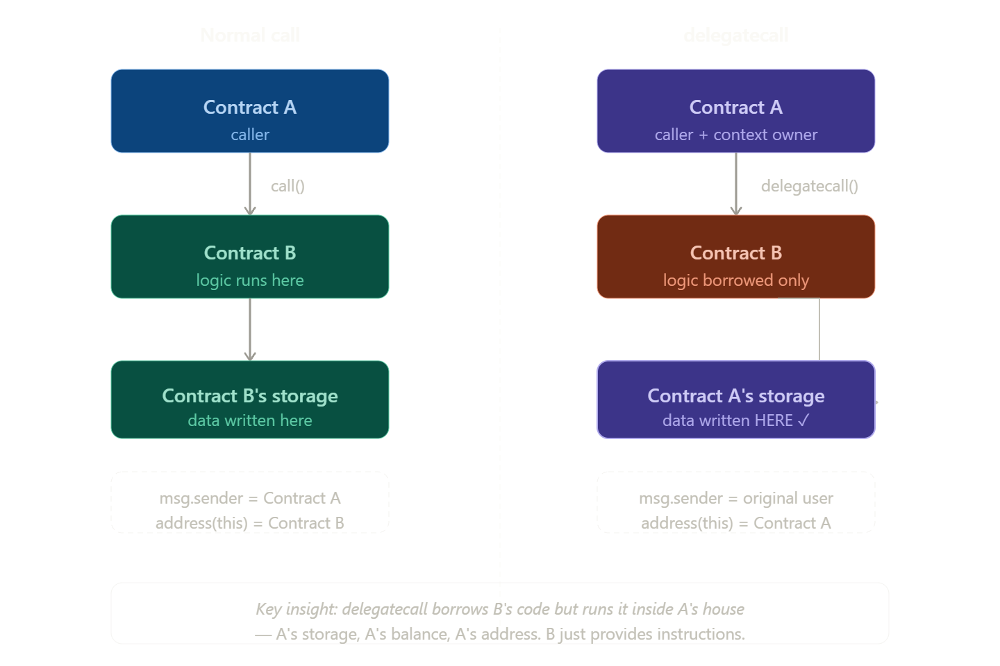

# Ethernaut

### Level 6 : Delegation

Date - 23-04-2026

Difficulty :  Simple (if you know about `delegateCall`)

Think of `delegatecall` like **hiring a contractor to work in your house, using your tools and your address.**

- Normal `call`: *"Hey Contract B, do this task using your own stuff"*
- `delegatecall`: *"Hey Contract B, lend me your **logic/code**, but run it in **my context** (my storage, my balance, my address)"*



#### Thinking :

- I think I just need to trigger `fallback` of Delegation with Method signature of `pwn` function.
- but How I get Signature of `pwn` function’s data?

`bytes4(keccak256("pwn()"))` → returns `0xdd365b8b` 

```jsx
await web3.eth.sendTransaction({
  from: player,
  to: instance,
  data: "0xdd365b8b"
})
```

---

### Level 7 : Force

Date - 23-04-2026

Difficulty :  Simple

Learning : 

- so I am exploring some of way to send value to any contract.
- if our function call is wrong and `fallback`  and `receive` functions are exist then we have a way to send value. but nothing is exist then there were very few way :
    - The "Self-Destruct" - When a contract is destroyed, it **must** send its remaining ETH to a target address. this transfer bypasses all code.
    - Pre-calculation - Contract addresses are deterministic (calculated based on the creator's address and their transaction count). You can calculate what a contract's address *will be*, send ETH to that address now, and then deploy the contract later.
    - Block Rewards
- Now I think latest solidity has remove the concept of `selfDestruct` so I deployed my contract with old solidity version :

```jsx
function deposit() external payable {}

    function selfDestroy(address payable  _recipient) public {
        selfdestruct(_recipient);
    } 
```

- First I sent some value via `deposit` and then simpliy call `selfDestroy` and pass address of game contract instance. and it works.

---

### Level 8 : Vault

Date : 23-04-2026

Difficulty : Simple

#### Thinking :

- I have read somewhere that Nothing is Hide in blockchain, not even your private fields. it is just introduce access layer. but we can see the value of it.
- so here, the First thought comes in my mind is : simply go to Etherscan of sepolia and check private variable value. but eventully contract not deploy on sepliat it is only within broser specific env.
- so I get to know about syntax :

```jsx
await web3.eth.getStorageAt(contractAddress, 1) // 1 is slot of variable
```

- which returns byte32 value "0x412076657279207374726f6e67207365637265742070617373776f7264203a2900" → `A very strong secret password :)`